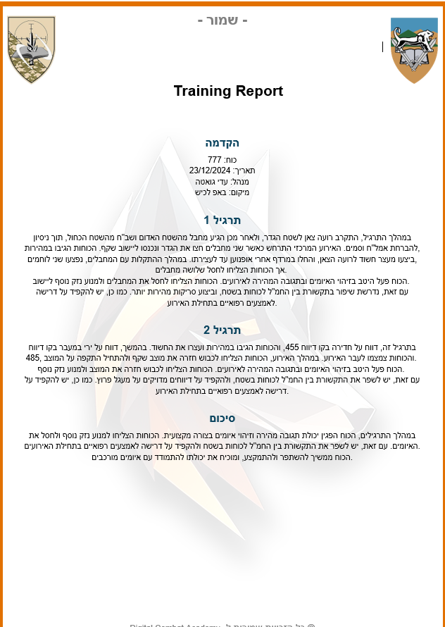
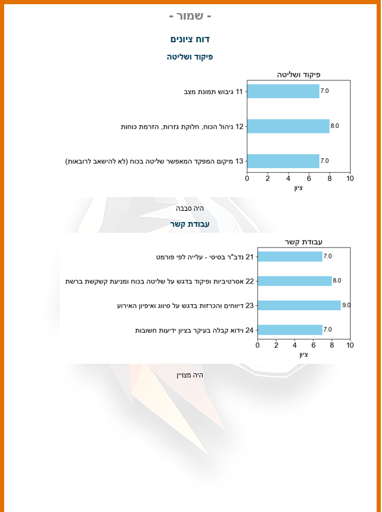

# 🪖 IDF Training Report Generator Bot

> A smart Telegram bot that turns raw training input into professional, structured military reports—complete with summaries, analysis, and visuals in Hebrew 🇮🇱


---

## 🎯 About the Project

This project automates the creation of **IDF-style training reports** through a Telegram interface. It enables users (trainers, officers, analysts) to:

- Input free-text training data via chat
- Enrich and format it using **GPT-4o-mini**
- Generate a clean, organized **Word report**
- Include dynamic **charts, grades, summaries**, and **multimedia links**

Built for **Digital Combat Academy (DCA)**, this tool streamlines the after-action review process into a simple and interactive workflow.


## 🚀 Key Features

- 🤖 **Telegram Bot Interface** – Intuitive and guided text entry for training debriefs  
- 🧠 **GPT-4o Integration** – Converts raw inputs into structured, military-style reports in Hebrew  
- 📄 **Word Document Generation** – Automatic creation of styled `.docx` files using a template  
- 📊 **Charts and Grades** – Dynamically generates visual summaries and scores for each section  
- 🔗 **Embedded Media** – Supports YouTube links, polls, and contact info with icons  
- 💬 **Military Formatting** – Report written in IDF tone and structure (Intro, Exercises, Summary)

---

## 🧱 System Architecture

1. **User** starts the Telegram bot and enters report info
2. Bot calls **GPT-4o-mini** to improve and format the content
3. Processed sections are sent to a document generator
4. **Bar charts** are created with grades and comments
5. All content is saved into a **Word file**
6. The final report is sent back to the user or stored

---




## 📈 Grades and Visual Analysis

One of the standout features of this bot is its ability to convert raw score input into clean, visual representations.

After each training session:
- Users enter scores for multiple categories
- The system calculates a **final grade**
- Charts are dynamically generated using **Matplotlib**
- Each section includes a **visual bar chart** and **custom comments**

This adds professionalism and clarity to the report, making it ideal for high-level debriefings.

---




## ⚙️ Installation

### 1. Clone the Repository

```bash
git clone https://github.com/your-username/telegram-training-bot.git
cd telegram-training-bot

### 2. Install Dependencies

pip install -r requirements.txt


### 3. Setup Environment Variables

TELEGRAM_BOT_TOKEN=your-telegram-token
OPENAI_API_KEY=your-openai-api-key

### 4. Run the Bot

python telegram_bot_main.py


## 🧠 Tech Stack

This project brings together several powerful Python libraries and APIs:

| Technology           | Purpose                                      |
|----------------------|----------------------------------------------|
| 🐍 `python-telegram-bot` | Provides the Telegram bot interface            |
| 🧠 `OpenAI GPT-4o-mini`    | Enhances raw text into structured IDF-style Hebrew summaries |
| 📄 `python-docx`          | Generates Word documents with structured formatting |
| 📊 `matplotlib`           | Creates visual bar charts and graphs       |
| 🔐 `dotenv`               | Loads and manages secret keys from `.env` file |
| 🖼 `Pillow`               | Adds support for image/icon embedding in reports |
| 🧰 `re` + `os`            | Utilities for regex parsing and file operations |


# 🤝 Contributing

We welcome contributions that improve this bot’s capabilities or enhance its user experience.

If you'd like to:
- Add PDF or multilingual report support
- Connect the bot to databases or dashboards
- Improve the formatting or templates

Feel free to fork the repo and open a pull request!
